    id000002-XV
    id000010-XV
    id000004-XV
    id000008-XV
    id000006-XV
    id000003-XV
    id000005-XV
    id000009-XV
    id000007-XV

    xy
    xy
    xy
    xy
    xy
    xy
    xy
    xy
    xy

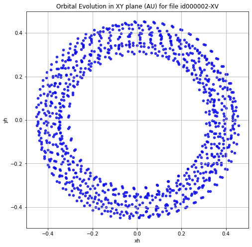

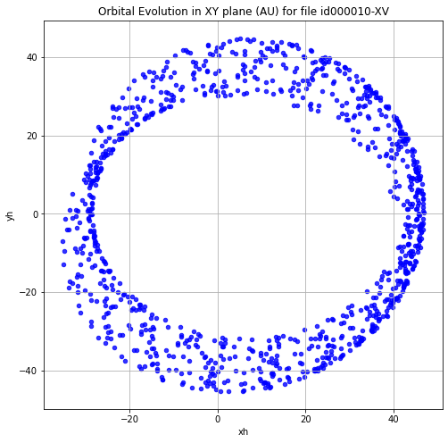

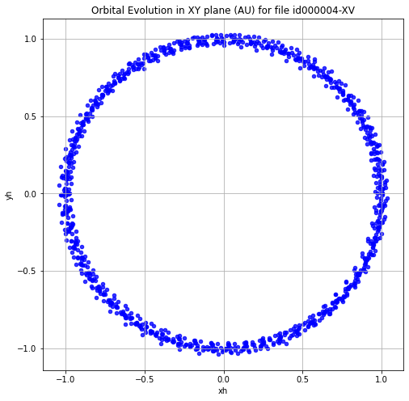

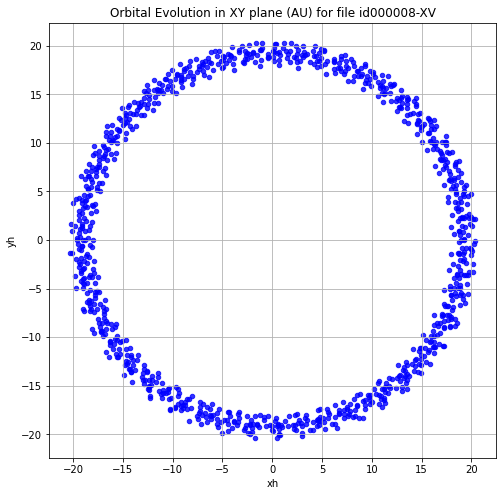

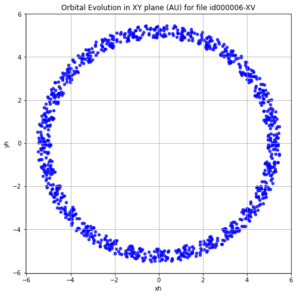

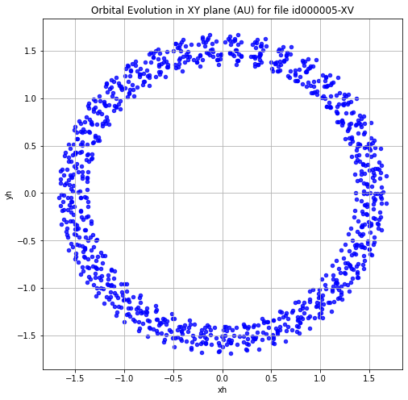

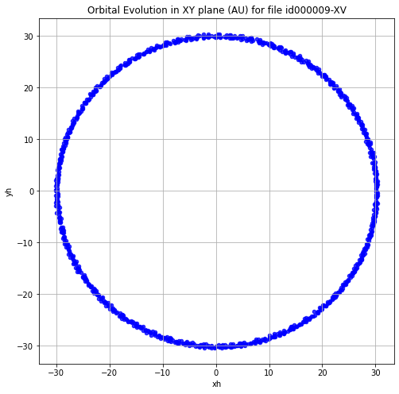

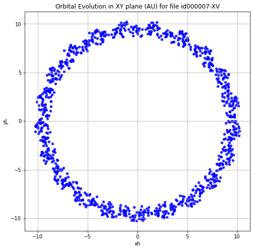

    xz
    xz
    xz
    xz
    xz
    xz
    xz
    xz
    xz

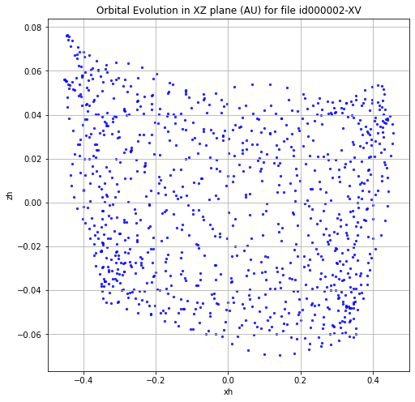

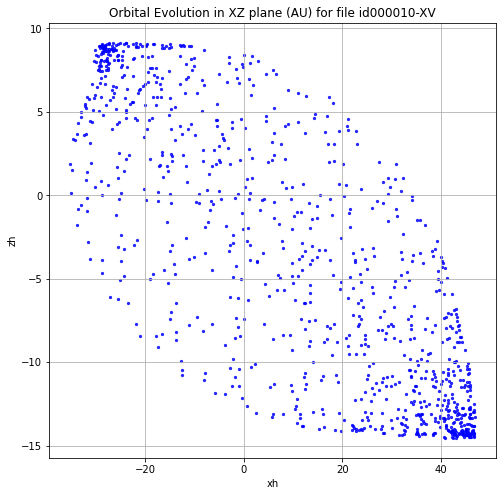

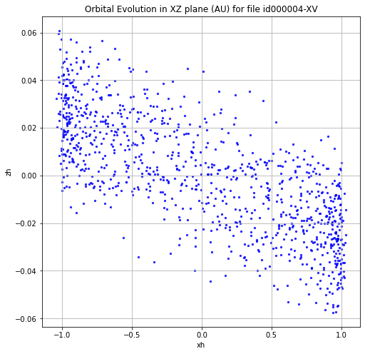

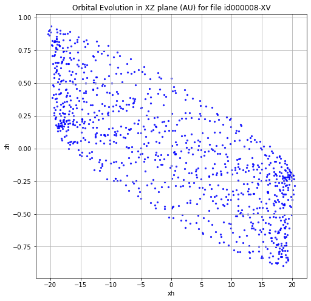

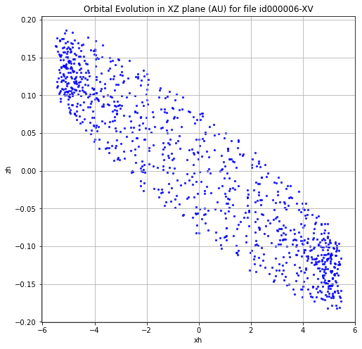

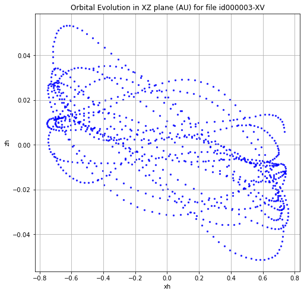

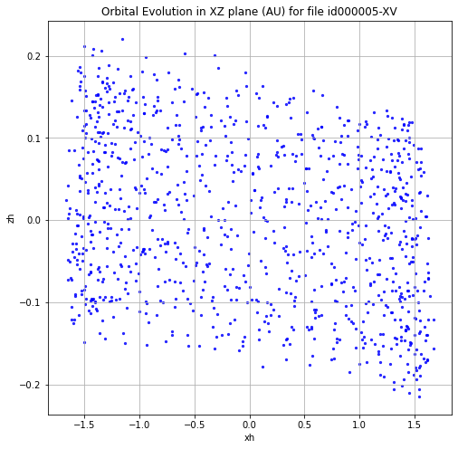

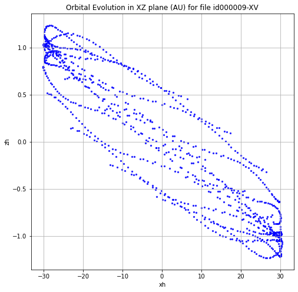

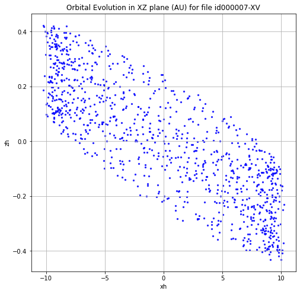

